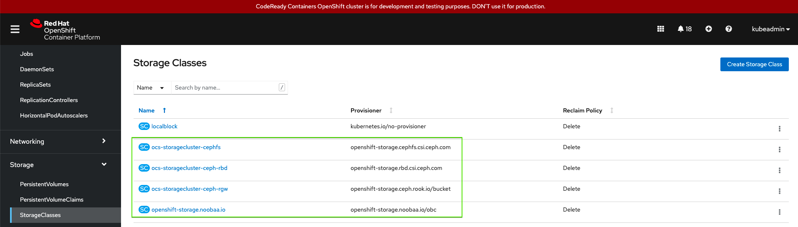

# Introduction
- Do you like OpenShift ? ..... Sweet !
- Do you use [CRC (CodeReady Containers)](https://developers.redhat.com/products/codeready-containers/overview) for local dev/test ?  ..... Great !
- Would you like persistent File/Block/Object Storage in your CRC Dev Environment  ..... Awesome, Now we are Talking !

# Introducing ODF-Nano
`ODF-Nano` lets you deploy `OpenShift Data Foundation` on your Laptop. 
For dev/test experimentation developers ofter need persistent storage with OpenShift (CRC). CRC did not had a persistent storage solution,  `ODF-Nano` solves persistent storage problem for CRC. 

# Setup
## Step -1 ::  Deploy CRC

```
mkdir ~/.crc
cd ~/.crc
#You can copy it from the Pull Secret section of https://cloud.redhat.com/openshift/create/local
cp pull-secret.txt ~/.crc
crc config set consent-telemetry no
crc config set enable-cluster-monitoring true
crc config set cpus 15 #ChangeME
crc config set memory 60000 #ChangeME
crc config view
crc setup
alias start='start  --log-level debug -p ~/.crc/pull-secret.txt'
alias crcssh='ssh -i ~/.crc/machines/crc/id_ecdsa core@"$(crc ip)"'
alias crcstart='crc start  --log-level info -p ~/.crc/pull-secret.txt'
crcstart
crcssh uptime
```
- Access https://console-openshift-console.apps-crc.testing from client machine

## Step -2 :: Deploy ODF-Nano on CRC
### Prerequisites
- Create a few raw devices that `ODF-Nano` will use
```
## Don't worry this is thin provisioned
sudo -S qemu-img create -f raw ~/.crc/vdb 50G
sudo -S qemu-img create -f raw ~/.crc/vdc 50G
sudo -S qemu-img create -f raw ~/.crc/vdd 50G
```

- Attach these devices to CRC VM
```
crc stop
virsh list
virsh dumpxml crc > crc.xml
vim crc.xml
```
- Add the following section to `crc.xml`
```
    <disk type='file' device='disk'>
      <driver name='qemu' type='raw' cache='none'/>
      <source file='/mnt/hdd_space1/mohit/.crc/vdb' index='1'/>
      <backingStore/>
      <target dev='vdb' bus='virtio'/>
      <alias name='virtio-disk1'/>
      <address type='pci' domain='0x0000' bus='0x05' slot='0x00' function='0x0'/>
    </disk>
    <disk type='file' device='disk'>
      <driver name='qemu' type='raw' cache='none'/>
      <source file='/mnt/hdd_space1/mohit/.crc/vdc' index='2'/>
      <backingStore/>
      <target dev='vdc' bus='virtio'/>
      <alias name='virtio-disk2'/>
      <address type='pci' domain='0x0000' bus='0x06' slot='0x00' function='0x0'/>
    </disk>
    <disk type='file' device='disk'>
      <driver name='qemu' type='raw' cache='none'/>
      <source file='/mnt/hdd_space1/mohit/.crc/vdd' index='3'/>
      <backingStore/>
      <target dev='vdd' bus='virtio'/>
      <alias name='virtio-disk3'/>
      <address type='pci' domain='0x0000' bus='0x07' slot='0x00' function='0x0'/>
    </disk>
```
- Apply XML file and start CRC
```
virsh define crc.xml
crc start
```
- List devices to verify
```
crcssh lsblk
```
### Deploy ODF-Naon  on CRC

-  Login to CRC using `kubeadmin`
`oc login -u kubeadmin -p <PWD> https://api.crc.testing:6443`

- Get `odf-nano`
```
git clone https://github.com/ksingh7/odf-nano.git
cd odf-nano
sh install_odf.sh
```
- Sample output
```
Setting up environment for ODF - this will take a few minutes
subscription.operators.coreos.com/ocs-subscription created
Waiting for operators to be ready
No resources found in openshift-storage namespace.
.No resources found in openshift-storage namespace.
...
.No resources found in openshift-storage namespace.
...............................
Operators are ready now
Finished up preparing the local storage
ODF is installing now, please be patient
ocsinitialization.ocs.openshift.io/ocsinit patched
pod/rook-ceph-tools-7d95854fb8-b78s2 condition met
ODF is installed now
```
- Verify ODF setup
```
oc get sc
```
- You now have File/Block/Object Storage Classes from ODF



## Access CRC from a remote client
By default CRC cluster is reachable from localhost. Inorder to access a CRC cluster remotely, we need to add a proxy layer.
This setup is useful, when you want to deploy CRC on a remote machine (Home server or a Cloud bare metal), there has to be a way for  you to acces CRC cluster remotely. This procedure help you access your CRC remotely.

-  Execute on the Host running CRC VM
```
export SERVER_IP=0.0.0.0
export CRC_IP=$(crc ip)

sudo apt-get install haproxy
sudo cp haproxy.cfg haproxy.cfg.backup
vim haprox.cfg
```

```
defaults
    mode http
    log global
    option httplog
    option  http-server-close
    option  dontlognull
    option  redispatch
    option  contstats
    retries 3
    backlog 10000
    timeout client          25s
    timeout connect          5s
    timeout server          25s
    timeout tunnel        3600s
    timeout http-keep-alive  1s
    timeout http-request    15s
    timeout queue           30s
    timeout tarpit          60s
    default-server inter 3s rise 2 fall 3
    option forwardfor

frontend apps
    bind SERVER_IP:80
    bind SERVER_IP:443
    option tcplog
    mode tcp
    default_backend apps

backend apps
    mode tcp
    balance roundrobin
    option tcp-check
    server webserver1 CRC_IP check port 80

frontend api
    bind SERVER_IP:6443
    option tcplog
    mode tcp
    default_backend api

backend api
    mode tcp
    balance roundrobin
    option tcp-check
    server webserver1 CRC_IP:6443 check port 6443
```

```
sudo sed -i "s/SERVER_IP/$SERVER_IP/g" haproxy.cfg
sudo sed -i "s/CRC_IP/$CRC_IP/g" haproxy.cfg

sudo systemctl start haproxy
sudo systemctl status haproxy

sudo netstat -plunt  | grep -i haproxy
```
- Example output from `netstat`
```
$ sudo netstat -plunt  | grep -i haproxy
tcp        0      0 0.0.0.0:80              0.0.0.0:*               LISTEN      9291/haproxy
tcp        0      0 0.0.0.0:443             0.0.0.0:*               LISTEN      9291/haproxy
tcp        0      0 0.0.0.0:6443            0.0.0.0:*               LISTEN      9291/haproxy

```

## MACos Client Node 
https://www.stevenrombauts.be/2018/01/use-dnsmasq-instead-of-etc-hosts/

```
brew install dnsmasq
sudo brew services start dnsmasq
mkdir -p /usr/local/etc/dnsmasq.d
touch /usr/local/etc/dnsmasq.d/crc.conf
vim /usr/local/etc/dnsmasq.d/crc.conf
```
```
address=/.testing/192.168.1.6
```
- verify dns resolution
```
sudo brew services restart dnsmasq
dig apps-crc.testing @127.0.0.1
dig console-openshift-console.apps-crc.testing @127.0.0.1
```
```
sudo mkdir /etc/resolver
sudo vim /etc/resolver/testing
nameserver 127.0.0.1

scutil --dns

ping -c 1 foo.api.crc.testing
ping -c 1 foo.apps-crc.testing
ping -c 1 console-openshift-console.apps-crc.testing
```

## Uninstall ODF-Nano
```
oc annotate storagecluster ocs-storagecluster uninstall.ocs.openshift.io/cleanup-policy="delete" --overwrite 
oc annotate storagecluster ocs-storagecluster uninstall.ocs.openshift.io/mode="forced" --overwrite

oc delete -n openshift-storage storagecluster --all  --wait=true --timeout=10s

for i in  storageclusters.ocs.openshift.io/ocs-storagecluster cephblockpools.ceph.rook.io/ocs-storagecluster-cephblockpool cephfilesystems.ceph.rook.io/ocs-storagecluster-cephfilesystem cephobjectstores.ceph.rook.io/ocs-storagecluster-cephobjectstore cephclusters.ceph.rook.io/ocs-storagecluster-cephcluster ; do oc delete $i --wait=true --timeout=10s ; done

for i in  storageclusters.ocs.openshift.io/ocs-storagecluster cephblockpools.ceph.rook.io/ocs-storagecluster-cephblockpool cephfilesystems.ceph.rook.io/ocs-storagecluster-cephfilesystem cephobjectstores.ceph.rook.io/ocs-storagecluster-cephobjectstore cephclusters.ceph.rook.io/ocs-storagecluster-cephcluster ; do oc patch $i --type json --patch='[ { "op": "remove", "path": "/metadata/finalizers" } ]'  ; done

oc delete subscriptino ocs-subscription
oc delete csv ocs-operator.v9.9.0


for i in $(oc get node -l cluster.ocs.openshift.io/openshift-storage= -o jsonpath='{ .items[*].metadata.name }'); do oc debug node/${i} -- chroot /host rm -rf  /var/lib/rook; done

oc delete project openshift-storage

for i in localblock openshift-storage.noobaa.io ocs-storagecluster-ceph-rbd ocs-storagecluster-ceph-rgw ocs-storagecluster-cephfs ; do oc delete sc $i ; done

oc delete crd backingstores.noobaa.io bucketclasses.noobaa.io cephblockpools.ceph.rook.io cephclusters.ceph.rook.io cephfilesystems.ceph.rook.io cephnfses.ceph.rook.io cephobjectstores.ceph.rook.io cephobjectstoreusers.ceph.rook.io noobaas.noobaa.io ocsinitializations.ocs.openshift.io storageclusters.ocs.openshift.io cephclients.ceph.rook.io cephobjectrealms.ceph.rook.io cephobjectzonegroups.ceph.rook.io cephobjectzones.ceph.rook.io cephrbdmirrors.ceph.rook.io --wait=true --timeout=30s

oc delete project openshift-storage
for resource in $(oc api-resources --namespaced=true -o name); do echo "Retrieving $resource" && oc get $resource ; done;

export SC=localblock
oc get pv | grep $SC | awk '{print $1}'| xargs oc delete pv
oc delete sc $SC
oc project default
[[ ! -z $SC ]] && for i in $(oc get node -l cluster.ocs.openshift.io/openshift-storage= -o jsonpath='{ .items[*].metadata.name }'); do oc debug node/${i} -- chroot /host rm -rfv /mnt/local-storage/${SC}/; done
oc delete localvolumediscovery.local.storage.openshift.io/auto-discover-devices -n openshift-local-storage

oc project openshift-storage
LV=local-block
SC=localblock
oc delete pv -l storage.openshift.com/local-volume-owner-name=${LV} --wait --timeout=1m
oc delete storageclass $SC --wait --timeout=1m
[[ ! -z $SC ]] && for i in $(oc get node -l cluster.ocs.openshift.io/openshift-storage= -o jsonpath='{ .items[*].metadata.name }'); do oc debug node/${i} -- chroot /host rm -rfv /mnt/local-storage/${SC}/; done

crcssh
for i in vdb vdc vdd ; do crcssh sudo  wipefs -af /dev/$i ; done
for i in vdb vdc vdd  ; do crcssh sudo sgdisk --zap-all /dev/$i ; done
for i in vdb vdc vdd  ; do crcssh sudo dd  if=/dev/zero of=/dev/$i bs=1M count=100 oflag=direct,dsync  ; done
for i in vdb vdc vdd  ; do crcssh sudo blkdiscard /dev/$i ; done
```
##  Troubleshooting

- If running out of space, create a symlink for .crc
```
mkdir /mnt/hdd_space1/.crc
ln -s /mnt/hdd_space1/.crc ~/.crc
```

- To ssh into crc vm
```
ssh -i ~/.crc/machines/crc/id_ecdsa core@"$(crc ip)"
```
- Deep clean previous instance of crc
```
crc delete -f
rm -rf .crc/*. -v !(".crc/cache/*.crcbundle | pull-secret.txt") #ToTest
sudo virsh list --all
sudo virsh destroy crc
sudo virsh undefine crc
```
